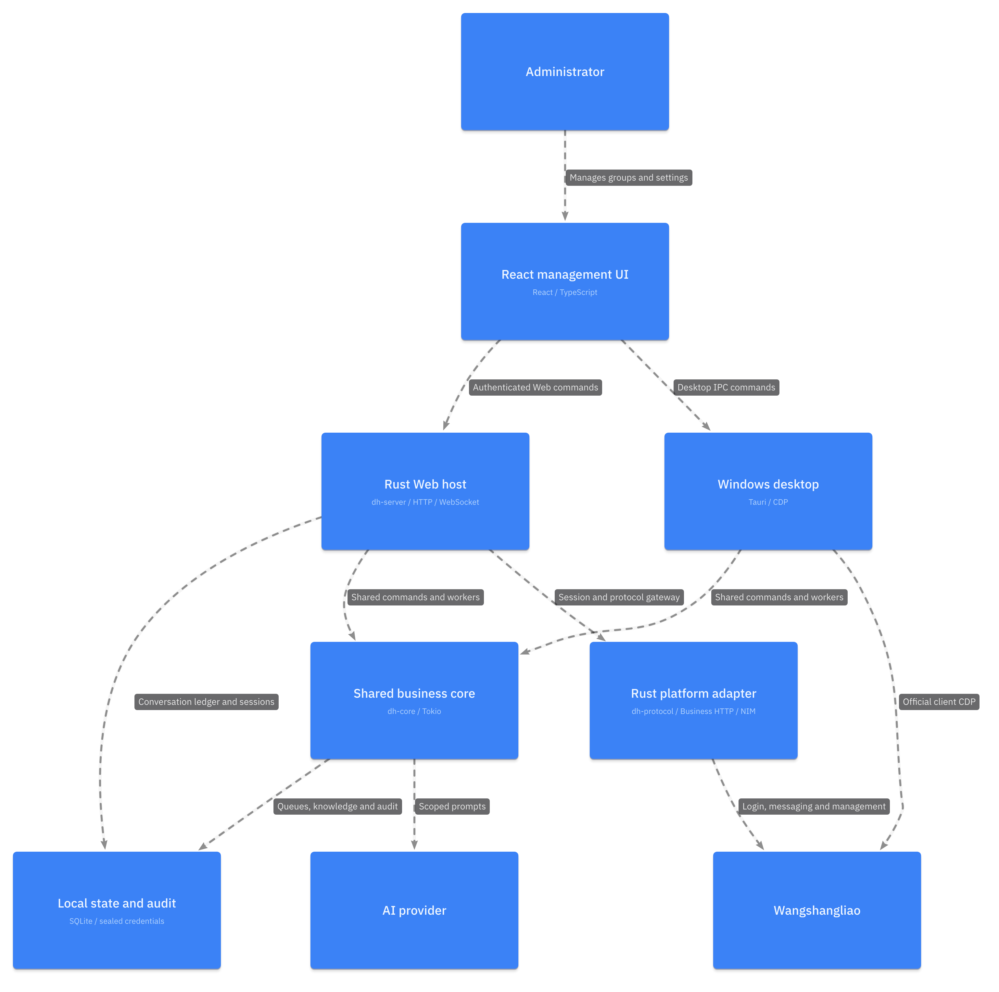

# DH BOT 3.0

[](https://github.com/DH-devmax/d-hbot/actions/workflows/ci.yml)

DH BOT 是 Rust 协议与共享业务核心、React Web 管理端和 Windows Tauri 群管理工作台。

本仓库保留为公开源码及旺商聊适配参考。后续私用 AI、知识库和 Telegram 接入转向
[AstrBot fork](https://github.com/DH-devmax/AstrBot)。旺商聊插件尚未实现，边界见
[交接说明](docs/ASTRBOT-HANDOFF.md)。这不是所有功能均已验收的稳定发行版。

当前源码技术快照：应用版本 `3.0.0-beta.1`，SQLite schema v14，生产端点
`127.0.0.1:9222`，默认 AI 模型 `deepseek-v4-pro`。

3.0 桌面代码位于 [`tauri3/`](tauri3/)，共享业务、纯 Rust 协议与 Web 宿主位于 `crates/`。正式程序不包含 Go 运行时、Go sidecar 或 Go 构建入口。旧 Go 2.7 源码归档已从当前工作目录移除，需要追溯时查阅 Git 历史。

## 产品范围



- 多群组与成员同步，以 `groupId` 识别群，以 `userId` / `nimId` 识别成员。
- 确定性群管规则、群名片、黑名单、知识库、AI 回复、任务、每日摘要和定时开关群。
- AI 群回复只由明确 `@DH` 或旺商聊提及元数据触发。
- SQLite schema v14，有序 inbox、幂等 outbox、动作回执归档、重启恢复和完整审计。
- Windows 托盘、单实例、旺商聊 DevTools 启动、固定登录分区和 UAC 维护流程。

## 本地构建与测试

无桌面依赖的 Web 宿主见 [Rust Web 登录与业务接口](docs/RUST-WEB-LOGIN.md)。Web 已复用共享业务处理函数；真实双账号测试覆盖收发、AI 知识问答、公告、成员禁言/解禁和撤回。未验收项与测试边界见 [最终阶段验收](docs/acceptance/2026-09-17/RESULTS.md)，CI 不代替真实平台验收。

仓库通过 GitHub Actions 执行生产、Fixture、界面和 Windows 打包门禁；生产版固定连接 `127.0.0.1:9222`，编译时移除所有 Fixture 入口：

```sh
cd tauri3
pnpm install --frozen-lockfile
pnpm test:contract-sanitizer
pnpm test:production-isolation
pnpm test:production
pnpm test:ui
pnpm tauri:build:production
```

内部开发版才包含 Fixture，使用独立端口和数据目录：

```sh
cd tauri3
pnpm test:fixture
pnpm test:e2e:fixture
pnpm tauri:build:developer
```

提交前还需执行 `pnpm verify:docs`，核对版本、schema、文档链接、凭据和真实身份脱敏。

Windows runner 在提交生产发布前执行生产打包和深度扫描；真实桌面探针通过手动 workflow 在自托管 runner 上执行。完整顺序见 [`docs/ENGINEERING-STANDARDS.md`](docs/ENGINEERING-STANDARDS.md)。

## 文件结构

```text
.
├── tauri3/
│   ├── src/                 React + TypeScript 界面
│   ├── src-tauri/           Rust/Tauri、Runtime、SQLite、CDP/NIM 网关
│   ├── contracts/           脱敏 Contract v2 与能力基线
│   ├── scripts/             构建、隔离扫描、打包和真实机探针
│   └── README*.md           构建与校准补充说明
├── package/                 默认群管规则模板
├── crates/                  共享业务、Rust 协议与 Web 服务
├── docs/                    使用、架构、协议、数据、测试和发布文档
├── tools/                   文档、脱敏、协议与支持包校验脚本
└── .github/workflows/       GitHub Actions 门禁与 Windows 生产打包
```

常用入口：

- 使用和隐私：[DH使用手册](docs/DH使用手册.md)、[诊断与支持包](docs/DIAGNOSTICS-AND-SUPPORT.md)。
- 设计和协议：[架构](docs/ARCHITECTURE.md)、[技术设计](docs/TECHNICAL-DESIGN.md)、[协议契约](docs/PROTOCOL-CONTRACT.md)、[数据库](docs/DATABASE-SCHEMA.md)。
- 测试和发布：[工程规范](docs/ENGINEERING-STANDARDS.md)、[Windows 验收](docs/WINDOWS-ACCEPTANCE.md)、[真实业务测试](docs/REAL-BUSINESS-TEST.md)、[发布架构](docs/RELEASE-ARCHITECTURE.md)。
- 工具：[文档校验](tools/verify_docs.py)、[仓库脱敏扫描](tools/verify_repository_redaction.py)、[支持包校验](tools/verify_support_bundle.py)。

## 数据与发布

- 生产数据：`%APPDATA%\DH\3.0`
- 开发 Fixture 数据：`%APPDATA%\DH\fixture`
- 核心源码仓库已开源；GitHub Actions 在 Linux 上执行通用门禁，在 Windows runner 上构建和扫描生产包，真实旺商聊桌面验收仍需手动触发的自托管 Windows runner。
- 个人发行采用未签名便携 ZIP，随包提供 `SHA256SUMS.txt`，通过管理员公布的云盘链接分发。
- [`DH-devmax/d-hbot-releases`](https://github.com/DH-devmax/d-hbot-releases) 仅作为可选下载说明或历史索引，不构建程序、不保存源码和 Fixture。
- Windows 首次启动可能显示“未知发布者”或 SmartScreen 提示，这是当前未签名个人发行的预期状态。

本地发布步骤见 [`docs/LOCAL-RELEASE.md`](docs/LOCAL-RELEASE.md)，仓库边界见 [`docs/RELEASE-ARCHITECTURE.md`](docs/RELEASE-ARCHITECTURE.md)。

详细进度和验收边界见 [`tauri3/STATUS.md`](tauri3/STATUS.md)。

纯 Rust 协议可独立测试，无需安装 Node、浏览器或 Tauri：

```sh
cargo test --manifest-path crates/dh-protocol/Cargo.toml --locked
```

该库已通过真实服务端的全新 Rust 登录、业务读取、续期、NIM 认证、消息同步/确认及重连。尚未替换桌面生产 CDP 网关，长期运行和完整平台验收仍待完成。具体历史进度见[协议契约](docs/PROTOCOL-CONTRACT.md#纯-rust-直连还原进度)。

## Web 实验入口

新增 `crates/dh-core`（与桌面共用业务源码，不依赖 Tauri）、`crates/dh-server`
（本机 HTTP/WebSocket 服务）和 `package/web`（部署示例）。共享命令、后台队列与页面事件已接入。
`serve-rust` 提供浏览器人工验证、Rust 登录、收发、群管、续期重连及退出；`serve-cdp` 保留官方客户端路径。

```sh
cargo build --manifest-path crates/dh-server/Cargo.toml --locked --release
cd tauri3
pnpm build:web
cd ..
# 使用独立目录，不能指向正在运行的桌面端数据目录。
crates/dh-server/target/release/dh-server init-admin ./DH-web-data
DH_PROTOCOL_CONFIG=/secure/dh-deployment.json \
  crates/dh-server/target/release/dh-server serve-rust ./DH-web-data ./tauri3/dist-web
```

访问 `http://127.0.0.1:8787`，使用一次性激活码设置管理员账号，再完成人工验证登录。
Rust 模式不依赖官方客户端；部署方仍须提供有效协议配置，仓库不含第三方密钥。
结果未知不自动重发，WebSocket 重连后页面重新读取快照。

部署示例：[systemd](package/web/dh-server.service)、[Nginx](package/web/nginx.conf.example)。
反向代理时将准确的 HTTPS Origin 作为 `serve-rust` 最后一个参数，服务仍仅监听回环地址，
仅信任显式配置的代理来源。Linux HTTPS 部署、长期运行与 Windows 真实机仍需单独验收。

`.local-backups/`、运行数据库、密封凭据和原始采集不进入公开仓库；迁移不自动复制群消息或密钥。

独立 Rust 模式使用 `DH_PROTOCOL_CONFIG` 指定部署配置，再以 `serve-rust` 启动。
该模式不会调用 CDP，浏览器直接呈现验证组件，Rust 执行业务与 NIM 请求。
部署字段、会话生命周期与验收边界见 [Rust Web 登录](docs/RUST-WEB-LOGIN.md)。
