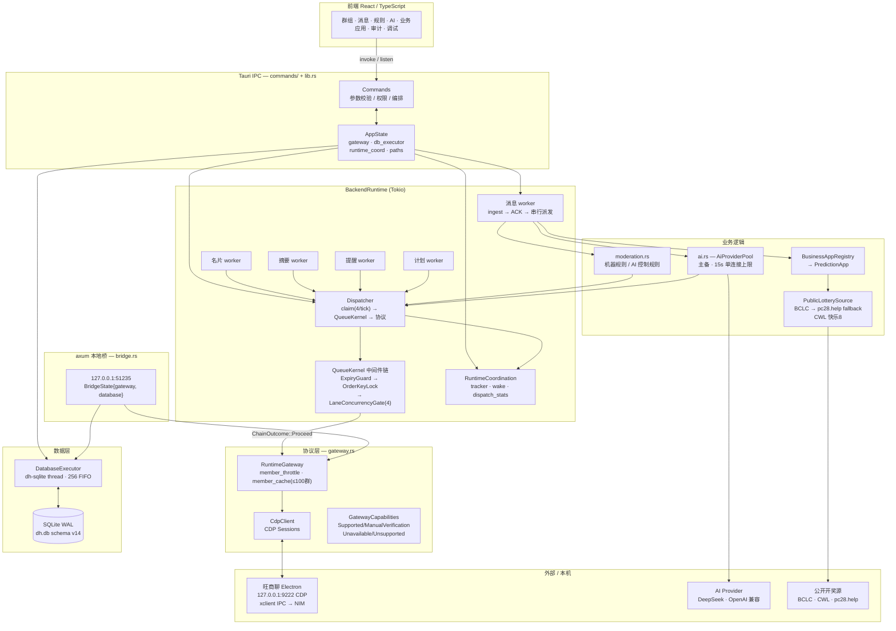
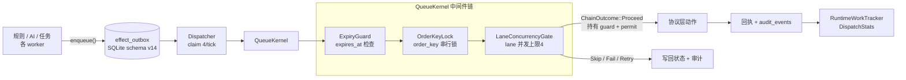
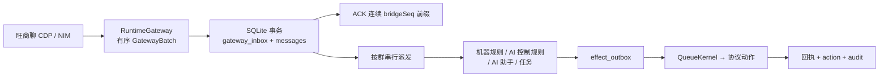
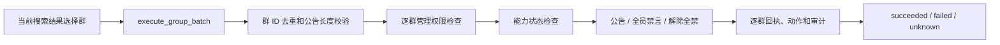
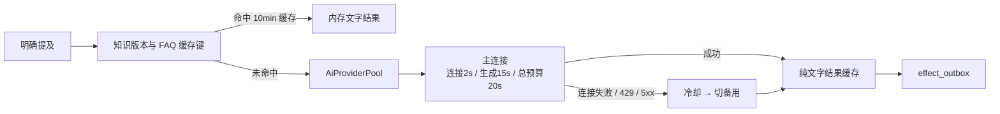
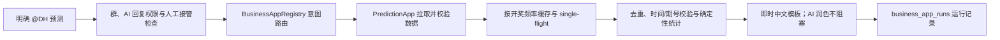
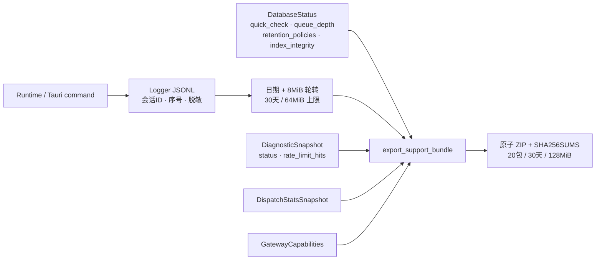

# DH BOT 3.0 架构

本文先回答"数据如何流动"。开发时的模块边界、并发和失败语义见
[`TECHNICAL-DESIGN.md`](TECHNICAL-DESIGN.md)；数据库表和唯一约束见
[`DATABASE-SCHEMA.md`](DATABASE-SCHEMA.md)；协议、回执和能力状态见
[`PROTOCOL-CONTRACT.md`](PROTOCOL-CONTRACT.md)；完整生产 command 与事件清单见
[`API-REFERENCE.md`](API-REFERENCE.md)。

---

## 整体架构图



---

## 分层

| 层 | 主要代码 | 职责 |
|---|---|---|
| React | `tauri3/src` | 页面、表单、批量选择、逐项结果和离线状态 |
| Tauri command | `commands/`（按域分文件）、`lib.rs`（AppState 与注册表） | 强类型参数校验、权限检查、服务编排 |
| BackendRuntime | `runtime/`、`runtime_work.rs` | 消息流水线、Dispatcher、规则、AI、任务、计划 |
| 业务逻辑 | `moderation.rs`、`ai.rs`、`business_apps.rs`、`prediction.rs` | 规则判断、AI 决策、预测数据源 |
| 协议 | `gateway.rs` | CDP、Electron xclient IPC、NIM、成员缓存、能力 |
| 数据 | `database.rs`、`repository.rs` | `DatabaseExecutor` 单线程事务、幂等和审计 |
| 本地桥 | `bridge.rs` | axum HTTP 入口，将外部请求转为 outbox 副作用 |

前端不直接访问 SQLite、密钥或任意协议路由。所有写操作经过固定枚举 command，再进入权限、能力和参数校验。

---

## 副作用队列与 QueueKernel

所有外部动作（回复、撤回、禁言、改名、欢迎、提醒、公告）统一写入 `effect_outbox`，由 Dispatcher worker 消费：



`effect_outbox` 的每行有 `priority`、`lane`、`order_key`、`correlation_id`、`origin`、`expires_at` 六个 schema v14 新列。`QueueKernel::run_chain` 返回 `ChainOutcome::Proceed{order_guard, lane_permit}`，调用方必须持有这两个 guard 直到协议调用完成，才能释放并发槽。

**DispatchStats** 以原子计数器记录 `dispatched / proceeded / skipped / rejected / chain_micros`，通过 `RuntimeCoordination.dispatch_stats` 暴露给诊断包和调试页。

---

## 入站消息



消息以 `(accountId, groupId, serverMessageId)` 去重。副作用使用稳定 `dedupe_key` 去重；回执不确定时标记 `unknown`，进入人工核对流程。`GatewayBatch` 每批最多100条（`MAX_GATEWAY_BATCH=100`），成员名单缓存最多 100 个群（`MAX_MEMBER_CACHE_GROUPS=100`），超出时按最旧 `checked_at` 驱逐。

---

## 批量群控



批量调用按选择顺序执行，单群失败不会阻断后续群。公告使用同一份文本；AI 优化只修改草稿。

---

## AI、规则与人工操作

- AI 只由明确 `@DH` 或旺商聊提及元数据触发；普通出现 `DH` 保持静默。
- 机器规则只运行确定性 matcher，命中后直接进入 outbox，不调用模型；AI 控制规则与机器规则使用独立群开关。
- 一条消息只发起一次语义分类请求并同时判断全部启用类别；超时只记录失败，不回退为本地猜测。
- AI 助手返回的 `recall` 建议不会绕过独立权限进入协议层。
- 规则支持全局或多群绑定；成员白名单使用稳定 `userId`，可按当前名、原名、DH 名称、旺商号或 NIM 身份搜索。
- 其他成员消息撤回优先使用 `nim.getHistoryMsgs` 精确定位再调用 `nim.recallMsg`；HTTP `1001` 是永久失败，不进入重试。

### AI 性能与主备连接



每群 AI 回复使用独立顺序队列，跨群及 AI 规则共享最多 2 个并发许可，不阻塞消息 ACK 和机器规则。

---

## 运行任务可视化与 DispatchStats

`RuntimeWorkTracker` 把消息、AI、预测、协议写入、名片、同步、提醒、摘要和计划聚合为脱敏快照，前端启动后只监听 100ms 合并后的 `runtime-work-updated` 事件。`RuntimeCoordination` 同时持有 `tracker`、`wake`（Notify）和 `dispatch_stats`（原子计数），由 `AppState` 和 `BackendRuntime` 共享：

```
RuntimeCoordination {
    tracker:        RuntimeWorkTracker  ← UI 进度 + 失败项
    wake:           Arc<Notify>         ← Dispatcher tick 唤醒
    dispatch_stats: DispatchStats       ← dispatched / proceeded /
}                                         skipped / rejected / chain_micros
```

`DispatchStats` 快照在诊断包的 `dispatchStats` 字段中输出，并可在调试页实时读取。

---

## 业务应用与预测



- 加拿大28：优先 BCLC 官方 Keno 年度文件，不可达时回退 `pc28.help/api/keno.json`（parse_public_keno_snapshot 行级容错，单行字段缺失只跳过不中止）。
- PC28/北京28：中国福彩网官方快乐8，DH 按公开约定派生三位结果。
- 比特币28 / 腾讯一分彩28：无可核验算法或官方开奖源，保持不可用。
- 所有公开 HTTP 响应使用 `read_capped_body`（20 MiB 流式上限）。

---

## axum 本地桥

`bridge.rs` 在 `127.0.0.1:51235` 启动一个 axum 服务，用于接受来自本机第三方工具的副作用入队请求，不对外网暴露：

```
POST /enqueue  →  BridgeState.database.enqueue_effect(EffectOutboxRequest)
                  返回 EnqueuedEffect{id, inserted, state}
GET  /status   →  BridgeState.gateway.diagnose() → DiagnosticSnapshot
```

`BridgeState{gateway: Arc<dyn RuntimeGateway>, database: DatabaseExecutor}` 由 `AppState` 在启动时注入，与主运行时共享同一个 `DatabaseExecutor` 和 `RuntimeGateway`。

---

## 内存边界

| 常量 | 值 | 位置 | 作用 |
|---|---|---|---|
| `MAX_GATEWAY_BATCH` | 100 | `gateway.rs` | 单次 CDP 轮询最大事件数 |
| `MAX_MEMBER_CACHE_GROUPS` | 100 | `gateway.rs` | 成员名单缓存上限，超出驱逐最旧群 |
| `MAX_MEMBER_EVENT_CACHE` | 500 | `gateway.rs` | 单次成员事件合并上限 |
| `MAX_REPORTED_SET` | 500 | `runtime/mod.rs` | 已报告运行项去重集合上限 |
| `MAX_TRACKED_ITEMS` | 200 | `runtime_work.rs` | RuntimeWorkTracker 活跃项上限 |
| `AI_PROVIDER_TIMEOUT` | 15 s | `ai.rs` | 单 AI 连接生成上限 |

所有上限在编译期固定，诊断包的 `memoryCaps` 字段输出当前值以供核对。

---

## 诊断日志与支持包



`diagnostic.json` 自 Phase 6 起包含：
- `database.indexIntegrity` — `PRAGMA integrity_check(16)` 结果
- `queueDepth` — `effect_outbox` 按 state 分组计数
- `retentionPolicies` — `retention_policies` 表当前配置
- `memoryCaps` — 编译期内存上限表
- `dispatchStats` — Dispatcher 累计计数器快照
- `connection.rateLimitHits` — 成员查询连续限速次数

诊断包不含 `dh.db`、`secrets.dat`、AI Key、Cookie、原始消息正文或 Fixture 数据。
