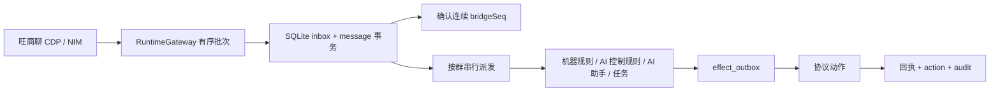
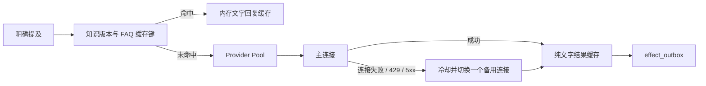
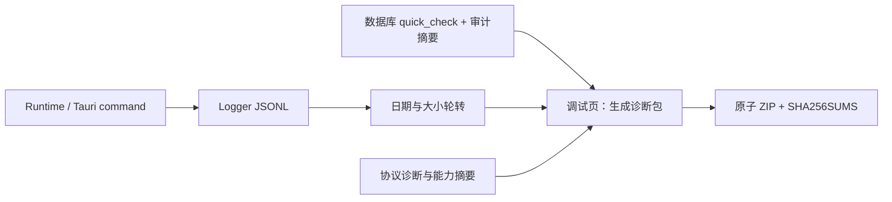

# DH BOT 3.0 架构

本文先回答“数据如何流动”。开发时的模块边界、并发和失败语义见
[`TECHNICAL-DESIGN.md`](TECHNICAL-DESIGN.md)；数据库表和唯一约束见
[`DATABASE-SCHEMA.md`](DATABASE-SCHEMA.md)；协议、回执和能力状态见
[`PROTOCOL-CONTRACT.md`](PROTOCOL-CONTRACT.md)；完整生产 command 与事件清单见
[`API-REFERENCE.md`](API-REFERENCE.md)。

## 分层

| 层 | 主要代码 | 职责 |
|---|---|---|
| React | `tauri3/src` | 页面、表单、批量选择、逐项结果和离线状态 |
| Tauri command | `tauri3/src-tauri/src/lib.rs` | 强类型参数校验、权限检查、服务编排 |
| Rust service | `runtime.rs`、`moderation.rs`、`ai.rs`、`business_apps.rs` | 消息、规则、AI、业务应用、任务、计划和副作用 |
| 数据 | `database.rs`、`repository.rs` | `DatabaseExecutor` 单线程事务、幂等和审计 |
| 协议 | `gateway.rs` | DevTools/CDP、旺商聊 HTTP 路由与 NIM 调用 |

前端不直接访问 SQLite、密钥或任意协议路由。所有写操作都经过固定枚举 command，再进入权限、能力和参数校验。

## 入站消息

消息以账号、群和服务器消息 ID 去重。副作用使用稳定键去重；回执不确定时标记 `unknown`，进入人工核对流程。

## 批量群控

批量调用按选择顺序执行，单群失败不会阻断后续群。公告使用同一份文本；AI 优化只修改草稿。

## AI、规则与人工操作

- AI 只由明确 `@DH` 或旺商聊提及元数据触发。
- 机器规则只运行确定性 matcher，命中后直接进入 outbox，不调用 AI；没有规则冷却，连续消息会逐条判断，账号级协议队列仍保持至少 500ms 写入间隔。
- AI 控制规则与机器规则使用独立群开关。一个消息只发起一次语义分类请求并同时判断全部启用类别；超时只记录失败，不回退为本地猜测。
- AI 助手聊天、AI 控制规则、机器规则和人工群控分别记录审计来源。AI 助手返回的撤回建议不会绕过独立权限进入协议层。
- 规则支持全局或多群绑定；成员白名单使用稳定 `userId`，可按当前名、原名、DH 名称、旺商号或 NIM 身份搜索选择。角色豁免不参与 v2 规则。
- 其他成员消息撤回优先使用 `nim.getHistoryMsgs` 精确定位，再调用 `nim.recallMsg` 并等待撤回通知；HTTP `1001` 是永久失败，不进入重试。
- 人工群控必须由使用者点击并确认，不受 AI 开关影响。
- 所有高影响动作在执行前重新检查当前账号、群归属、角色和能力状态。

### AI 性能与主备连接

- `AiProviderPool` 按账号配置指纹复用 `reqwest::Client`、TLS 会话和 keep-alive；连接超时 2 秒，单连接最多 15 秒，一次请求最多尝试两个连接且总预算 20 秒。每群 AI 回复使用独立顺序队列，跨群及 AI 规则共享最多 2 个并发许可，不阻塞消息 ACK 和机器规则。
- 最近上下文限制 8 条/2400 字，知识限制 3 条/3600 字；Chat Completions 输出限制 512 tokens，Responses 输出限制 1024 tokens；人格只在 system 消息注入一次。
- FAQ 纯文字回复使用每账号语义边界内的 512 项、10 分钟内存缓存。上下文依赖、动作、任务、预测、处罚和摘要不进入缓存。
- 知识命中缓存 60 秒，键包含文档内容哈希和群绑定版本；文档、状态或绑定变化会自然产生新键并立即失效旧结果。

## 运行任务可视化与调度

`RuntimeWorkTracker` 把消息处理、AI、预测、协议写入、名片、同步、提醒、摘要和计划聚合为脱敏的运行通道。前端启动时读取一次快照，之后只监听 100ms 合并后的 `runtime-work-updated` 事件；Logo 环显示当前任务的可测进度，无法量化时显示不定进度，左下角显示当前任务，点击后打开只读队列。

- 同一账号/群/任务类型只显示一个聚合项及后续数量，避免突发消息为前端创建大量对象；显示 ID 使用哈希，不暴露账号、群或成员协议字段。
- 成功项保留 5 秒；失败和未知回执保留到使用者关闭队列抽屉。抽屉只导航到相关业务页，不提供跳过、重排或强制重试。
- 消息和 AI 回复保持每群有序；AI 回复、AI 规则和预测润色共享最多 2 个并发许可。协议写入仍按账号串行并保持至少 500ms 间隔。
- 数据库上下文读取在一个 `DatabaseExecutor` job 内完成，减少 actor 往返。effect、名片、提醒、摘要和计划 worker 在空闲时等待通知，并保留 30 秒兜底检查，不再以 500ms/5s 固定频率空查数据库。
- 启动时从 SQLite 恢复消息、effect 和名片积压；恢复数量与运行期已观察数量取最大值，避免启动竞态造成重复计数。

## 业务应用与预测

- `BusinessAppRegistry` 是唯一应用入口；运行时不再使用预测专用文本分支。
- `PublicLotterySource` 优先使用无需 Key 的公开源：加拿大28先读取 BCLC 官方 Keno 年度文件，官方端点不可达时回退到公开的 Keno 原始数据镜像；PC28/北京28读取中国福彩网官方快乐8结果，再按公开约定派生三位结果。官方原始开奖、公共镜像和 DH 派生结果在界面及日志中明确区分。
- BCLC 最新数据缓存 60 秒、历史缓存 3 分钟；中国福彩网每日结果缓存 30 分钟、历史缓存 1 小时。相同请求使用 single-flight，避免频繁访问公开服务。
- 比特币28虽然存在公开区块数据，但没有统一可核验的 28 派生算法；腾讯分分彩28没有可核验的官方公开开奖源。两者保持不可用，不猜测、不伪造。
- ZCG Token 接口仅作为显式兼容回退，Token 只允许从运行环境读取且不会编译进 EXE。没有真实开奖时间或通过校验的响应时不生成候选方向。
- `PredictionApp` 默认停用，账号级开启后仅适用于已启用管理、AI 自动化和 `reply` 权限的群。首次观测到新期号先立即发送统计模板，再由受退出信号管理的单一后台 worker 预热 AI 润色文本；缓存 30 分钟并按账号、彩种、期号、算法版本和 Provider 版本隔离。
- AI 只接收规范化统计，不接收数据源地址、认证字段或原始响应；其动作和任务输出在该应用中被忽略。
- 过期、缺期或数据异常时不给候选方向；AI 超时或非法输出时使用固定应用模板。
- `business_app_runs` 以稳定运行键去重，记录数据新鲜度、AI 使用状态、耗时和错误。本地测试不发群消息、不创建任务、不执行群管动作。

## 连接与能力探测

生产版固定连接 `127.0.0.1:9222`。启动后通过 `9222/CDP -> Electron xclient IPC -> NIM` 执行只读探测，检查 ZCG 已验证路由签名、双层响应结构、NIM 方法和成员回调入口。应用版本与主脚本 SHA-256 只参与诊断和协议指纹，不单独锁住写能力。

`GatewayCapability` 使用 `Supported / ManualVerification / Unavailable / Unsupported`，同时记录 `ZcgContract / WangElectron / NimRuntime / ManualReceipt` 来源以及人工、自动执行边界。ZCG 基线能力探测通过后直接开放；公告只读通过后允许首次手工发布，写入与回读一致后才开放批量和自动公告。

每账号写操作按至少 500ms 间隔串行；群列表缓存 10 秒、成员名单缓存 30 秒，重复读取使用同一刷新任务。写后验证绕过缓存，不确定回执进入人工确认。

## 诊断日志与支持包

`Logger` 只写入经过统一脱敏的 JSONL 记录，包含进程会话 ID、递增序号、时间、级别和错误文字。它不记录 API Key、Token、Cookie、Authorization、密码、旺商聊登录数据或原始消息正文。日志按日期和 8 MiB 分段，保留策略是 30 天且总量不超过 64 MiB。

`export_support_bundle` 在独立阻塞线程中读取数据库状态、最近审计、连接诊断、能力摘要和近期日志，之后以临时文件写入 ZIP 并原子替换。导出前再次脱敏；审计内的账号、群和成员会替换成包内稳定别名。ZIP 不含 SQLite、秘密文件、Electron Profile、原始消息或源码，包内 `SHA256SUMS.txt` 用于逐文件完整性核对。
