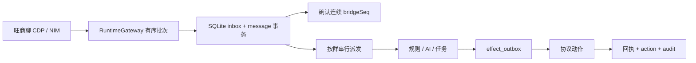

# DH BOT 3.0 架构

## 分层

| 层 | 主要代码 | 职责 |
|---|---|---|
| React | `tauri3/src` | 页面、表单、批量选择、逐项结果和离线状态 |
| Tauri command | `tauri3/src-tauri/src/lib.rs` | 强类型参数校验、权限检查、服务编排 |
| Rust service | `runtime.rs`、`moderation.rs`、`ai.rs` | 消息、规则、AI、任务、计划和副作用 |
| 数据 | `database.rs`、`repository.rs` | `DatabaseExecutor` 单线程事务、幂等和审计 |
| 协议 | `gateway.rs` | DevTools/CDP、旺商聊 HTTP 路由与 NIM 调用 |

前端不直接访问 SQLite、密钥或任意协议路由。所有写操作都经过固定枚举 command，再进入权限、能力和参数校验。

## 入站消息

消息以账号、群和服务器消息 ID 去重。副作用使用稳定键去重；回执不确定时标记 `unknown`，进入人工核对流程。

## 批量群控

批量调用按选择顺序执行，单群失败不会阻断后续群。公告使用同一份文本；AI 优化只修改草稿。

## AI、规则与人工操作

- AI 只由明确 `@DH` 或旺商聊提及元数据触发。
- 确定性规则与 AI 自动化独立，默认模板停用，默认动作仅撤回。
- 人工群控必须由使用者点击并确认，不受 AI 开关影响。
- 所有高影响动作在执行前重新检查当前账号、群归属、角色和能力状态。

## 连接与能力校准

生产版固定连接 `127.0.0.1:9222`。`GatewayCapabilities` 使用 `Supported / Unverified / Unsupported`，并绑定旺商聊文件版本和主脚本 SHA-256。未知版本允许读取，自动写能力保持待校准状态。
